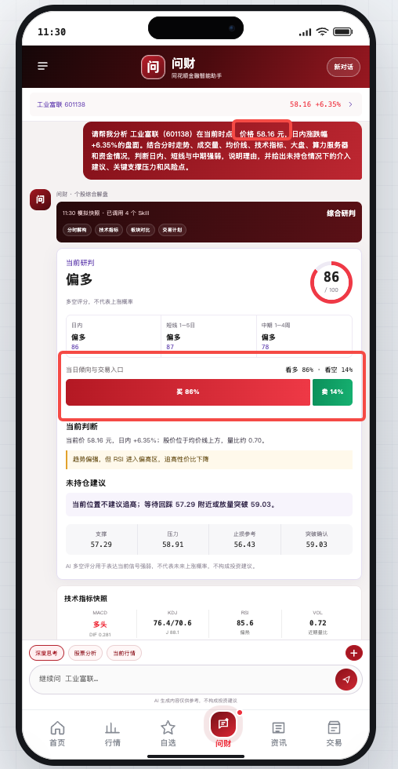
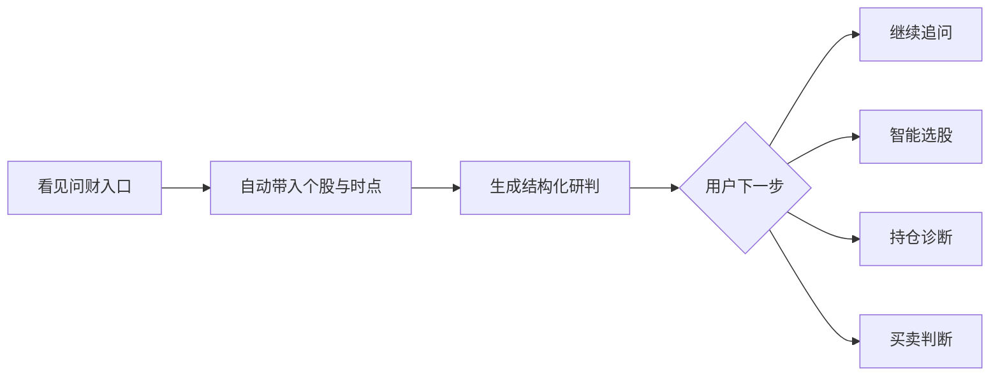
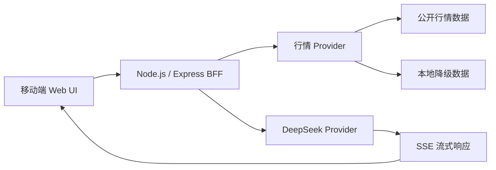

<div align="center">
  
  <h1>乐乐的 AI Trading Agent</h1>
  <p><strong>让 AI 在用户最需要判断的时刻出现。</strong></p>
  <p>面向移动端投资场景的 AI 行情分析应用，将实时行情、分时时点、技术指标和交易动作组织成可理解、可追问的研判链路。</p>
  <p>
    <a href="https://leleaitradeanalyst.vercel.app/"></a>
    <a href="docs/lele-ai-trading-agent-feature-report.pdf"></a>
  </p>
  <p>
    
    
    
    
  </p>
</div>

<p align="center">
  
  &nbsp;&nbsp;
  
</p>

## 产品价值

| 增强 AI 感知 | 承接下一步动作 |
|---|---|
| AI 入口直接出现在分时图、盘口和买卖区域，用户看行情时就能知道 AI 可以解释什么。 | 研判结果继续连接追问、选股、持仓分析、条件提醒和买卖判断，不让对话停在一段文字里。 |

## 四个核心功能

### 个股即时解盘

用户从分时图右上角或底部操作区点击“问财解盘”，系统自动带入股票名称、最新价格、盘口、成交量和技术指标，直接生成当前研判。

### 分时时点解读

长按分时图定位到具体时间，问财会围绕该时点的价格、涨跌幅、成交量、均价线和前后走势解释异动原因，并保留上下文供用户继续追问。

### 多空研判与动作承接

报告同时展示日内、短线和中期倾向，结合动态买卖比例、持仓建议、支撑压力、止损参考和突破确认位，把分析结论转化成用户容易理解的下一步。

### 通用问财

底部问财开启不绑定股票的新对话，支持市场解读、智能选股、个股分析、持仓诊断、交易计划和使用帮助。

## 使用链路



## 体验亮点

- 分时图与指标只展示上午真实时段，系统时间统一锚定在 `11:30`。
- 长按分时图约 `0.42s` 唤起十字线与“问财解读此处”。
- 存量股票在后台预热研判，点击后优先快速展示完整报告。
- AI 输出整块呈现，避免逐字刷新造成页面闪烁。
- 买入与卖出区域会根据多空倾向动态调整视觉比例。
- 点击底部问财始终进入干净的新对话；从个股页进入时才携带股票上下文。
- 真实行情失败时自动降级，并明确标注数据来源、时间和降级状态。

## 技术架构



| 模块 | 实现 |
|---|---|
| 前端 | 原生 HTML、CSS、JavaScript，移动端优先 |
| 服务端 | Node.js、Express，同源 `/api/v1` |
| AI | DeepSeek 服务端代理，支持普通问答与金融研判 |
| 行情 | 真实公开行情优先，本地数据自动降级 |
| 会话 | 个股独立上下文、通用新对话、历史会话 |
| 部署 | Vercel |

## 本地运行

```bash
npm install
cp .env.example .env
npm start
```

在 `.env` 中填写：

```env
DEEPSEEK_API_KEY=your_api_key
DEEPSEEK_BASE_URL=https://api.deepseek.com
DEEPSEEK_MODEL=deepseek-chat
PORT=18765
```

打开 [http://localhost:18765](http://localhost:18765)。

## API

| 接口 | 用途 |
|---|---|
| `GET /api/health` | 服务与配置状态 |
| `GET /api/v1/market/home` | 首页市场数据 |
| `GET /api/v1/market/stock/:symbol/overview` | 个股、分时、盘口与指标 |
| `GET /api/v1/watchlist` | 自选列表 |
| `POST /api/v1/wencai/chat` | 问财对话与 SSE 流式输出 |
| `GET /api/v1/news` | 市场资讯 |
| `GET /api/v1/account/portfolio` | 持仓信息 |

## 当前边界

已完成行情展示、分时时点研判、AI 多轮对话、多空报告和前后端部署。真实券商委托、长期策略回测、组合级收益归因、个性化风险参数和完整预警体系尚未接入。

## 安全

DeepSeek API Key 仅由服务端读取，`.env` 已加入 Git 忽略列表。前端代码和公开仓库不包含真实密钥。

## 免责声明

AI 生成的多空判断、买卖比例、关键价位和持仓建议仅用于产品研究与信息辅助，不构成投资建议、交易指令或收益承诺。
