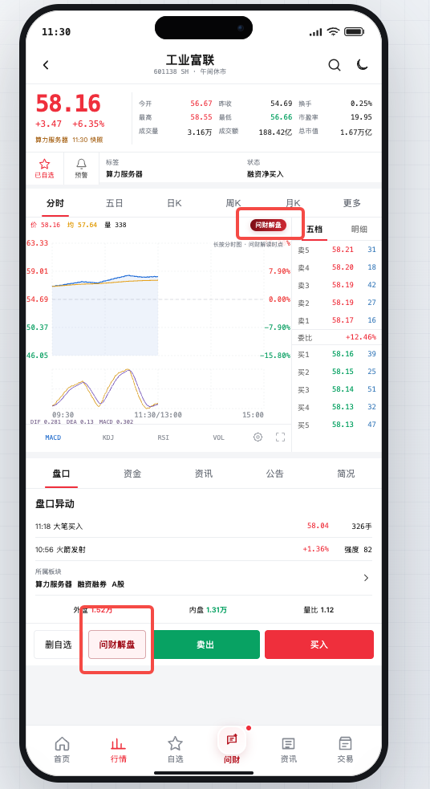

# 乐乐的 AI Trading Agent

面向移动端投资场景的 AI 行情分析应用。产品把问财能力嵌入个股分时、盘口和交易动作附近，帮助用户从“看到行情”快速进入“理解行情”和“采取下一步动作”。

[在线体验](https://leleaitradeanalyst.vercel.app/) · [功能报告 PDF](docs/lele-ai-trading-agent-feature-report.pdf)



## 核心功能

- 个股即时解盘：从分时图或买卖区直接发起研判，自动带入股票、价格、盘口和技术指标。
- 分时时点解读：长按分时图选择具体时点，分析该时点的量价变化、指标状态和关键位置。
- 多空研判与动作承接：展示日内、短线、中期观点，以及动态买卖倾向、持仓建议、支撑压力和风险边界。
- 通用问财：底部问财开启干净的新对话，支持市场解读、智能选股、个股分析和使用帮助。

## 技术结构

- 前端：原生 HTML、CSS、JavaScript
- 服务端：Node.js、Express
- AI：DeepSeek 服务端代理，支持 SSE 流式输出
- 行情：真实公开行情优先，异常时自动降级到本地数据
- 部署：Vercel

## 本地运行

```bash
npm install
cp .env.example .env
npm start
```

在 `.env` 中填写：

```env
DEEPSEEK_API_KEY=your_api_key
DEEPSEEK_BASE_URL=https://api.deepseek.com
DEEPSEEK_MODEL=deepseek-chat
PORT=18765
```

打开 [http://localhost:18765](http://localhost:18765)。

## 安全说明

DeepSeek API Key 仅由服务端读取，`.env` 已加入 Git 忽略列表。前端代码和公开仓库不包含任何真实密钥。

## 免责声明

AI 生成的多空判断、买卖比例、关键价位和持仓建议仅用于产品研究与信息辅助，不构成投资建议、交易指令或收益承诺。
